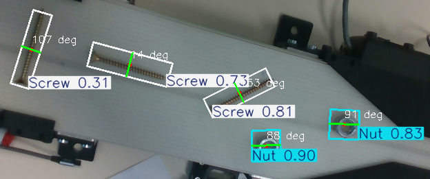
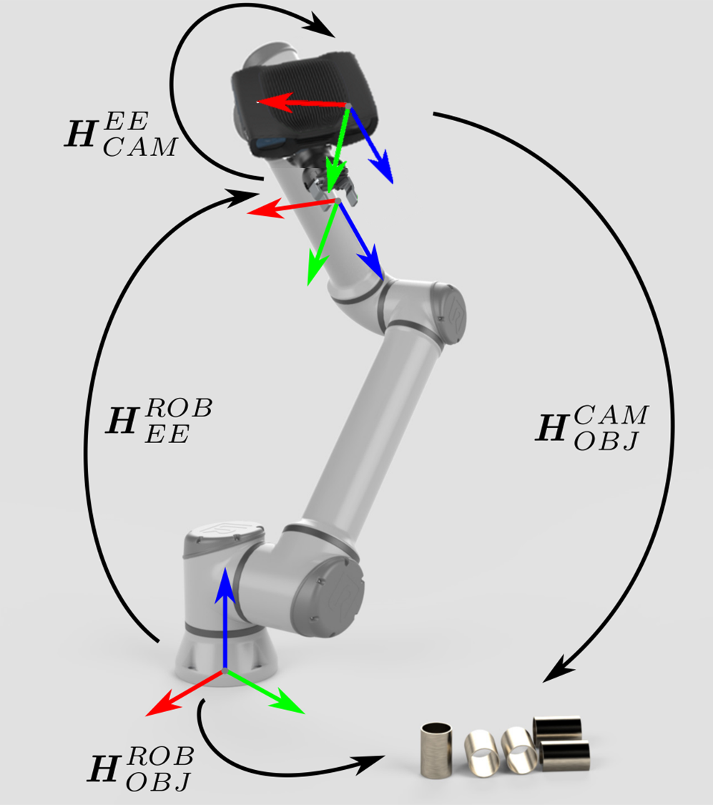
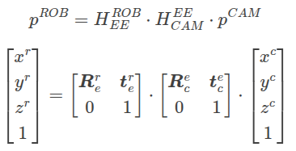

# 1. Industrial Parts Sorting Using Eye-in-Hand Vision with ROS 2 Humble

This project implements a robotic system that sorts industrial parts **screws and nuts** in real-time as they move along a conveyor belt. It combines **vision algorithm**, **robotics**, and **AI** using the following components:

- ***Intel RealSense D435*** depth camera
- ***Nvidia RTX 4000*** GPU 
- ***UR3e*** robotic arm
- ***Robotiq Hand-E Gripper***
- ***ROS 2 Humble***
- ***YOLO-OBB*** (Oriented Bounding Box) object detection model

The camera is mounted in an **eye-in-hand configuration**, meaning it moves with the robot arm, offering dynamic visual perception. The robot detects and picks objects based on their type and orientation using a fine-tuned YOLO-OBB model.

---
## 1.1. Table of Contents


- [1. Industrial Parts Sorting Using Eye-in-Hand Vision with ROS 2 Humble](#1-industrial-parts-sorting-using-eye-in-hand-vision-with-ros-2-humble)
  - [1.1. Table of Contents](#11-table-of-contents)
  - [1.2. YOLO-OBB Detection](#12-yolo-obb-detection)
  - [1.3. Main installations](#13-main-installations)
    - [1.3.1. Ros2](#131-ros2)
    - [1.3.2. Moveit2](#132-moveit2)
    - [1.3.3. UR drivers](#133-ur-drivers)
  - [1.4. Eye-in-Hand Extrinsic Calibration](#14-eye-in-hand-extrinsic-calibration)
    - [1.4.1. Moveit2\_calibration installation](#141-moveit2_calibration-installation)
    - [1.4.2. how to use the result of the calibration](#142-how-to-use-the-result-of-the-calibration)


---
## 1.2. YOLO-OBB Detection

*[YOLO-OBB](https://docs.ultralytics.com/fr/tasks/obb/)* extends standard object detection by predicting rotated bounding boxes. This is essential for understanding how the part is oriented on the conveyor and for computing the correct approach angle for the gripper.

- Input: RGB images
- Output: Object class + position + rotation angle
- Runs in real-time with GPU acceleration

For this application we've finetuned a yolo OBB model on [this dataset](https://universe.roboflow.com/ram-0ay3p/objectdetection-tovrk/dataset/2). The image bellow is a screenshot of the execution of [*yolo_inference.py*](https://github.com/Cedric-Loic/ur3e/blob/main/yolo_inference.py)

<p align="center">
  
</p>


## 1.3. Main installations 
### 1.3.1. Ros2

```bash

sudo apt install -y curl build-essential cmake git

locale  # check for UTF-8
sudo apt update && sudo apt install -y locales
sudo locale-gen en_US en_US.UTF-8
sudo update-locale LC_ALL=en_US.UTF-8 LANG=en_US.UTF-8
export LANG=en_US.UTF-8
locale  # verify settings

sudo apt install -y software-properties-common
sudo add-apt-repository universe

install curl -y
sudo curl -sSL https://raw.githubusercontent.com/ros/rosdistro/master/ros.key -o /usr/share/keyrings/ros-archive-keyring.gpg
echo "deb [arch=$(dpkg --print-architecture) signed-by=/usr/share/keyrings/ros-archive-keyring.gpg] http://packages.ros.org/ros2/ubuntu $(. /etc/os-release && echo $UBUNTU_CODENAME) main" | sudo tee /etc/apt/sources.list.d/ros2.list > /dev/null

sudo apt update
sudo apt upgrade

sudo apt install -y ros-humble-desktop
sudo apt install -y ros-humble-ros-base
sudo apt install -y ros-dev-tools

source /opt/ros/humble/setup.bash 
sudo apt install -y python3-rosdep
rosdep update

sudo apt update
sudo apt dist-upgrade
sudo apt install -y python3-colcon-common-extensions
sudo apt install -y python3-colcon-mixin
colcon mixin add default https://raw.githubusercontent.com/colcon/colcon-mixin-repository/master/index.yaml
colcon mixin update default
sudo apt install -y python3-vcstool
```

### 1.3.2. Moveit2
Then we install moveit2
```bash

mkdir -p ~/ros2_ws/src
cd ~/ros2_ws/src
git clone --branch humble https://github.com/moveit/moveit2_tutorials
vcs import --recursive < moveit2_tutorials/moveit2_tutorials.repos
sudo apt remove ros-$ROS_DISTRO-moveit*
sudo rosdep init
rosdep update
sudo apt update && rosdep install -r --from-paths . --ignore-src --rosdistro $ROS_DISTRO -y

cd ~/ros2_ws
colcon mixin add default https://raw.githubusercontent.com/colcon/colcon-mixin-repository/master/index.yaml
colcon mixin update default
colcon build --mixin release --executor sequential

echo -e '\nsource /opt/ros/humble/setup.bash\nsource ~/ros2_ws/install/setup.bash' >> ~/.bashrc
source ~/.bashrc
```

And then we install the ur drivers
### 1.3.3. UR drivers
```bash
sudo apt-get install -y ros-humble-ur
```


## 1.4. Eye-in-Hand Extrinsic Calibration
An **eye-in-hand** setup places the camera directly on the robot’s end-effector (the wrist or gripper). This offers several advantages:

- The robot can look at different positions dynamically.
- Calibration between camera and gripper becomes easier to perform.
- Scene interpretation is from the robot’s end effector point of view.

This configuration is particularly beneficial for tasks requiring precise interaction with objects whose positions and orientations change. To transform camera detections into the robot’s coordinate frame, we use ***extrinsic calibration***. This determines the transformation between the camera and the robot’s tool frame (the end of the wrist).

<p align="center">
  
</p>


The following equation describes how to transform a single 3D point from the depth camera to the robot base coordinate system:

<p align="center">
  
</p>

Our hand-Eye calibration was done using [`MoveIt2 Calibration`](https://github.com/AndrejOrsula/moveit2_calibration).


### 1.4.1. Moveit2_calibration installation

```bash
cd ~/ros2_ws/src
git clone https://github.com/AndrejOrsula/moveit2_calibration.git
vcs import src < src/moveit_calibration/moveit_calibration.repos --skip-existing
rosdep install -r --from-paths src --ignore-src --rosdistro ${ROS_DISTRO} -y
colcon build --symlink-install --cmake-args -DCMAKE_BUILD_TYPE=Release
source install/setup.bash
```
Please follow the [Hand-Eye Calibration](https://moveit.picknik.ai/humble/doc/examples/hand_eye_calibration/hand_eye_calibration_tutorial.html) tutorial to perform your extrinsic calibration before going to the next step.

### 1.4.2. how to use the result of the calibration

At the end of your calibration, you should have a static TF2 launch file 
